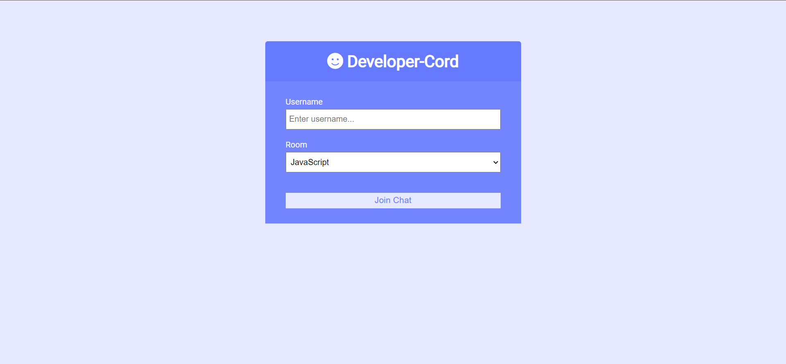
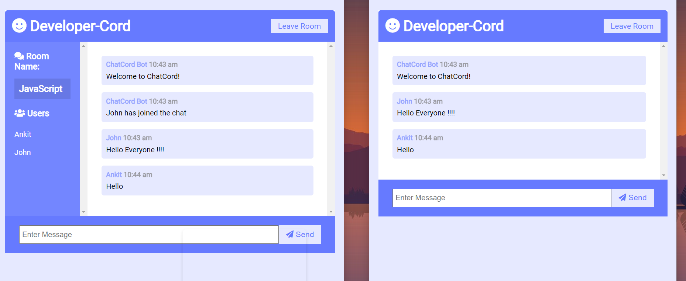

# Developer-Cord : Chat Room App

Realtime chat app with websockets using Node.js, Express and Socket.io with Vanilla JS on the frontend with a plain HTML and CSS





```
npm install
npm run dev

Go to localhost:3000
```
